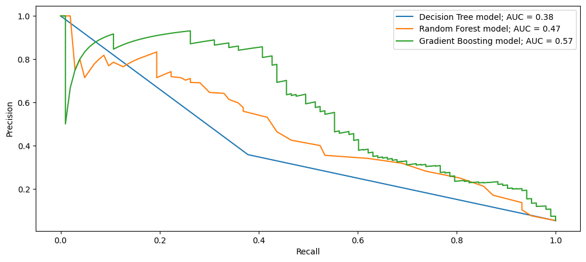

# Bankruptcy Prediction Model 🏭⛔

This repository contains the code and analysis for building a bankruptcy prediction model using Python. The dataset used in this project is the "bankrupt_data.csv" file (raw data can be found [here](https://archive.ics.uci.edu/ml/datasets/polish+companies+bankruptcy+data)), which contains financial data from various companies (64 features and target class: bankrupt/not bankrupt). The goal of this project is to train a model that can accurately predict whether a company will go bankrupt or not based on its financial features.

## Getting started
To get a copy of this project up and running on your local machine, you can clone this repository and follow these steps:

### Prerequisites

Before running the notebooks, you will need to have Python 3 installed on your machine, along with the some libraries. You can install these libraries by running the following command in your virtual environment:

    pip install -r requirements.txt

### Running the notebooks

To reproduce the results from this project, run the following notebooks in order:

    1. data_exploring.ipynb
    2. ensemble_models.ipynb
    3. gradient_boosting.ipynb

The notebooks contain step-by-step instructions for preprocessing the data, training the models, and evaluating their performance.

### Data Dictionary
A dictionary of the features used in this project can be found in the data_dictionary.ipynb notebook.

## Data Import and Cleaning 🧹

The first step in this project is to import the data and clean it. We use the pandas library to read the CSV file into a DataFrame, and then we check for missing values and what the data types are.

## Data Exploring (EDA) 🔍⛏

This step consisted in checking the balance of the target class (bankrupt / not bankrupt), finding features with outliers and explore its data distribution and checking for multicolinearity among the features. The main takeways from this EDA were:
- Our data is imbalanced.
- Many of our features have missing values that we'll need to impute. And since the features are highly skewed, the best imputation strategy is likely median, not mean. 
- It has autocorrelation issues, which means that we should steer clear of linear models, and try a tree-based model instead.

## Data Preparation 🔨

The first step to prepare our data to train ML models is to split it into two subsets: train and test sets. For the data preparation, which involves only the train set, we first need to address the imbalance issue of our data. Undersampling the majority class and oversampling the minority class were tested in order to balance the train data. Ultimately, for this particular case, it was noticed that over sampling the minority class would result on a better classifier.

## Model Training and Evaluation 🤖📊

It was used three different ML tree-based classifier algorithms from scikit-learn module to train our bankruptcy prediction model (Decision-Tree, Random Forest and Gradient Boosting). We use GridSearchCV to optimize the hyperparameters of our model, such number of estimators, maximum depth, cross-validation etc. We then evaluate our model using various metrics such as confusion matrix, classification report, precision-recall curve and AUC score.

## Results Interpretation 🧐

All models performed well on accuracy. However, as its job is to classify a highly imbalanced dataset (94.74% of not bankrupt firms), if it were to only classify them all as not bankrupt it would achieve that number of accuracy. Then, it becomes a problem to check for the best compromise between precision vs. recall. And, taking that into account, the gradient boosting model achieve a better performance, as the plot precision vs. recall is presented below.

## Future work 🔮🚀

In conclusion, we have successfully built a bankruptcy prediction model using Python and scikit-learn. Our model achieves good performance on the testing set and can be used to predict whether a company will go bankrupt or not based on its financial features. However, there is still room for improvement, such as collecting more data, trying different models (XGBoost for instance) or even trying some different under-sampling/over-sampling techniques, for instance, using SMOTE (Synthetic Minority Over-sampling Technique) which works by creating synthetic samples of the minority class by generating new data points along the line segments joining k minority class nearest neighbors.